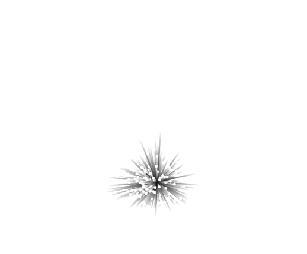
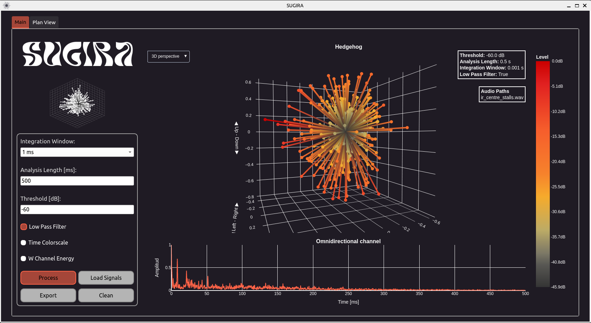
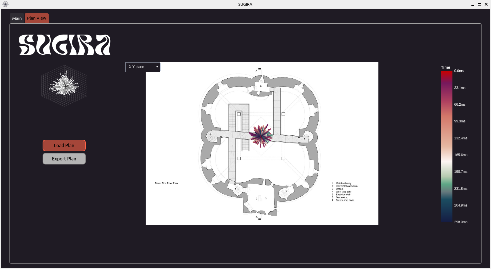

# Sea Urchin Grapher - Impulse Response Ambisonic

<div align="center">
    
</div>


---

<b>SUGIRA (Sea Urchin Grapher - Impulse Response Ambisonic)</b> is a software for visualizing Ambisonics impulse responses in 3D. It allows you to export data related to Azimuth, Elevation, Intensity, and the W channel over time. Additionally, it features a section where you can load a plan image and overlay the hedgehog plot on it, resize it, and rotate it to align the direct sound with the direction of the source in the three planes.
Read more about SUGIRA here.

<div align="center">
    
</div>

<div align="center">
    
</div>

 ---

 ## 🚀 Run GUI


1. Download or clone the repository.
 ```
 git clone https://github.com/francobach47/SUGIRA.git
cd SUGIRA
 ```

2. Create and initialize poetry environment

```
poetry install
poetry shell
```

*Note: If you encounter errors with `PyQtWebEngine`, the following command maybe help: <br>```pip install PyQtWebEngine==5.15.6```*


3. Run GUI

```
python3 sugira/gui.py
```

 ## 🌱 Getting Started


1. Download or clone the repository.
 ```
 git clone https://github.com/francobach47/SUGIRA.git
cd SUGIRA
 ```

2. Create and initialize poetry environment

```
poetry install
poetry shell
```

*Note: If you encounter errors with `PyQtWebEngine`, the following command maybe help: <br>```pip install PyQtWebEngine==5.15.6```*

3. Install the pre-commit hooks for code formating and linting with `black` and `pylint`.

```
pre-commit install
```

<hr>