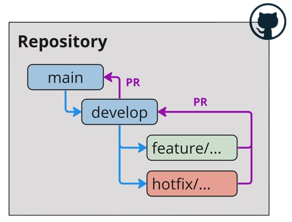

# **GitFlow**
GitFlow es una metodología de flujo de trabajo (workflow) para Git que se centra en el uso de ramas (branches) para gestionar el ciclo de vida de un proyecto.

---

## **Ramas principales**
GitFlow define dos ramas principales:

### `main`
- Esta rama representa la versión estable del proyecto y solo se actualiza cuando se han completado las funcionalidades y se han hecho pruebas de calidad adecuadas.
### `develop`
- Esta rama es la rama de desarrollo principal, donde se unen las ramas de características (`feature`) y las ramas de correcciones (`hotfix`) para probar y fusionar con la rama principal.

## **Ramas de soporte**
Además de las ramas principales, GitFlow define dos tipos de ramas de soporte:

### `feature/...`
- Se utilizan para desarrollar nuevas funcionalidades o mejoras en el proyecto. Se crean a partir de la rama `develop` y se fusionan de vuelta en ella cuando se ha completado la funcionalidad mediante un **pull-request**.
- Por ejemplo, si al proyecto se le desea agregar un nuevo front-end, se crea la rama `feature/front_end`

### `hotfix/...`
- Se utilizan para corregir errores críticos en las ramas `main` y/o `develop`. Se crean a partir de la rama `develop` y se mergean a `develop` mediante un **pull-request**, para luego mergear de `develop` a `main` mediante otro **pull-request**.
- Por ejemplo, si alguna librería externa (supongamos PyTorch) se actualizó y causa un problema en la versión estable, se crea la rama `hotfix/pytorch`

    

---

## **Nomenclatura de commits**
Siempre se recomienda seguir una nomenclatura clara y consistente para los commits. Los commits deben comenzar con un verbo en tiempo presente que describa el cambio realizado en el código. Algunos ejemplos son:

- `add`: Para añadir una nueva funcionalidad o archivo.
    - Ejemplo: `add: post_process.py and pre_process.py`
- `update`: Para actualizar un archivo existente.
    - Ejemplo: `update: Added new method in inference.py`
- `fix`: Para corregir un error.
    - Ejemplo: `fix: Fixed variable names in train.py`
- `remove`: Para eliminar archivos o código.
    - Ejemplo: `remove: test.py`
